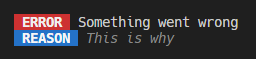

# **Chalk Konsole**

A small library which exposes some helpful utilities for using the [Chalk](https://www.npmjs.com/package/chalk) library in the console. _This is an early version and currently contains only a few methods, but will be expanded in the future._

## Installation

```bash
npm install --save chalk-konsole
```

## Usage

```ts
import konsole from "chalk-konsole";

konsole.err("Something went wrong", "This is why");
```



## Methods

| Method    | Description                                                         |
| --------- | ------------------------------------------------------------------- |
| `err`     | Prints an error message with red indicator and optional reason.     |
| `warn`    | Prints a warning message with yellow indicator and optional reason. |
| `info`    | Prints an info message with blue indicator.                         |
| `success` | Prints a success message with green indicator.                      |
